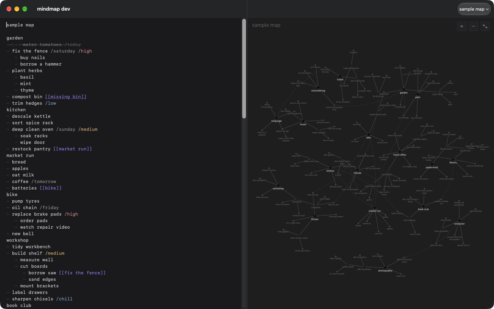

# mindmap

this is a macos based mindmap, similar to formatting on notes but creates a visual mindmap like seen on obsidian.



## how to use it

type your list on the left. the map draws itself on the right.

```
weekend
garden
- water tomatoes
- fix the fence /saturday /high
    - buy nails
    - borrow a hammer
reading
- finish the mystery novel /sunday
- return library books [[errands]]
errands
- post office
```

| you type | what it does |
|---|---|
| first line | the map's title |
| a line with no dash | a group (big black dot) |
| `- ` | a task under that group |
| `[x]` after the dash | marks a task done |
| tab, then `- ` | a subtask (tab again to go deeper) |
| `/today` `/tomorrow` `/friday` | due date |
| `/high` `/medium` `/low` `/chill` | priority |
| `[[name]]` | a dashed link to another task or group |

- click a group or task to highlight its branch and zoom in. click empty space to zoom back out. (coming soon)
- pinch or use the mouse wheel to zoom, two fingers to move around.
- editing adds or removes nodes without rearranging your map.
- drag a node to move it. its subtasks follow and crowded neighbors move aside. it stays where you put it until you reshuffle (⇧⌘R).
- press enter to continue a list, tab to indent, shift+tab to go back out. it works just like notes.
- press ⌘N for a new map.
- `/high` tasks can show up in the Calendar app. this is off by default; turn it on in settings (⌘,). (coming soon)
- hit reshuffle (⇧⌘R) for a new animated layout. the forces panel is coming soon.

your maps are saved automatically as plain text files in a folder you choose the first time you open the app (we suggest Documents/mindmap, which keeps them private from other apps). nothing is ever saved inside this project folder.

### keyboard shortcuts

| keys | what it does |
|---|---|
| return | continue the list |
| tab / shift+tab | indent / outdent the bullet |
| ⌘] / ⌘[ | indent / outdent the current or selected bullets |
| ⇧⌘X | mark the current or selected tasks done, or not done |
| ⌃⌘↑ / ⌃⌘↓ | move a task and its subtasks up / down |
| ⌘N | new map |
| ⇧⌘] / ⇧⌘[ | next / previous map |
| ⌘= (or ⌘+) / ⌘- | zoom in / out |
| ⌘0 | fit the whole map |
| ⇧⌘R | reshuffle (new layout, forgets moved nodes) |
| arrow keys | move around the map (when the map has focus) |
| ⌘1 / ⌘2 | focus the editor / the map |

## how to set it up

you need macos 14 or newer and xcode 26 or newer (free on the app store).

```
git clone https://github.com/RoshanMatrubai/mindmap.git
cd mindmap
make install
```

mindmap is now in your applications folder. open it like any other app.

## how to modify it (for developers)

| command | what it does |
|---|---|
| `make run` | builds and opens a dev copy ("mindmap dev") with its own separate data, so your real maps are never touched |
| `make test` | runs all tests |
| `make preview` | saves a picture of a sample map to `build/preview.png` |
| `make lint` | checks formatting (`make format` fixes it) |

- code layout and design notes are in `docs/`.
- using an ai coding agent? it should read `AGENTS.md` first. agents never commit; they suggest a commit message for you to review.
- see `CONTRIBUTING.md` before opening a pull request.

## license

MIT, see `LICENSE`. bundled fonts use the SIL Open Font License; their license files ship with the fonts and are listed in `THIRD_PARTY_NOTICES.md`.
